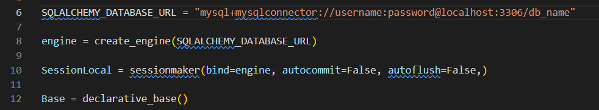

# FastAPI Basic Authentication System

This project implements a basic authentication system using FastAPI, providing user creation, login, and CRUD operations on user data. It also integrates CORS middleware and serves static files.

## Features

- User registration and login with JWT-based authentication.
- CRUD operations on user data.
- CORS middleware for handling requests from multiple origins.
- Static file handling.
- Basic user authentication system with session handling (login and logout).

## Tech Stack

- **Backend**: FastAPI
- **Database**: SQLAlchemy (MySQL/PostgreSQL)
- **Authentication**: OAuth2 with Password (Bearer) and JWT tokens
- **Middleware**: CORS
- **Static Files**: FastAPI static file serving

## Installation

1. Clone the repository:

   ```bash
   git clone https://github.com/rahul-charaki/fastapi-basic-authentication.git

2. Navigate to the project directory:

    ```bash
    cd your-repository-name

3. Create a virtual environment and activate it:

    ```bash
    python -m venv venv
    source venv/bin/activate  # On Windows use `venv\Scripts\activate`

4. Install the required dependencies:

    ```bash
    pip install -r requirements.txt

5. Add DataBase Credentials:

    ```\app\database.py
    

6. Run The project:

    ```bash
    uvicorn main:app --reload

7. Open the link http://127.0.0.1:8000/docs to test the API's 